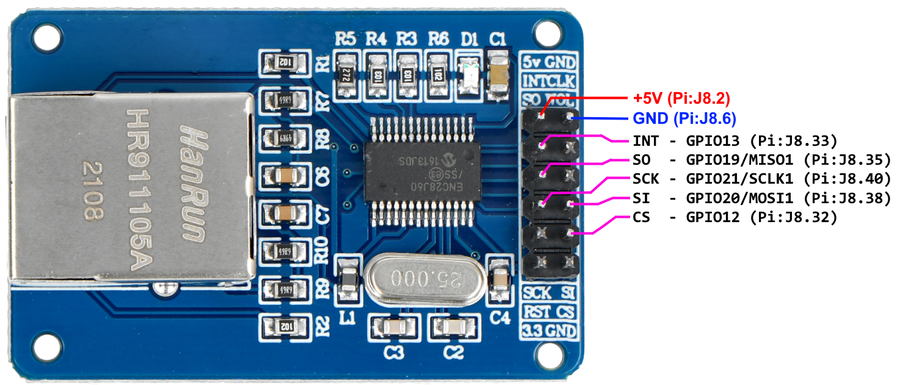

# ENC28J60 on Raspberry Pi SPI1

There is one overlay for ENC28J60 to work with SPI2 bus, but Pi 0 don't have it. 
So with a bit of help of google-fu and this post on StackExchange: https://raspberrypi.stackexchange.com/a/104911/112073

I have written my own overlay for ENC28J60 hooked up to SPI1 and with custom CS & INT pins used.

If you want use different pins then:

- change in `dts` file GPIO number `13` for INT/IRQ (in `fragment@0 > overlay > eth1 > interrupts` and in `fragment@1 > overlay > eth1_pins > brcm,pins` )
- change SPI1 CS0 in SPI1 overlay config , if you want to use different CS (1..2) then I think you also should change number in `reg` (`fragment@0 > overlay > eth1 > reg`) for used CS*n* .


## Wiring

Wiring is simple:

|ENC28J60 pin|RPi GPIO Pin|Note|
|-|-|-|
|5V|+5V|5V supply for module|
|GND|GND|Supply & signal ground|
|INT|GPIO13|Interrupt from ENC28J60|
|SO|GPIO19/MISO1|ENC SerialOut / RPi SPI1 MISO *(Master Input Slave Output 1)*|
|SCK|GPIO21/SCLK1|ENC SerialClock / RPi SPI1 Clock|
|SI|GPIO20/MOSI1|ENC SerialIn / RPi SPI MOSI *(Master Out Slave In 1)*|
|CS|GPIO12|ENC Chip Select / SPI1 CS|





## Overlay

If you want to use different GPIOs for INT/IRQ and CS then you need to pay attention and correct lines to work with your wiring:

- **Different CS*n* number**: Line `20` in section: `fragment@0 > __overlay__ > eth1 > reg` I think you need to correct the number to match used CS*n* *( :warning: needs verification :bangbang: )*.

- **Different INT/IRQ GPIO**: 
	
	- Line `24`: in section: `fragment@0 > __overlay__ > eth1 > reg` you need to change GPIO number to your wiring.
	- Line `35`: in section: `fragment@1 > __overlay__ > eth1_pins > brcm,pins` you need to change GPIO number to your wiring.

	*I think you shold be able to change this in config.txt while configuring overlay :thinking:*


Compile `dts` file into binary `dtbo` using this command:
```
dtc -@ -I dts -O dtb -o enc28j60-spi10.dtbo enc28j60-spi10-overlay.dts
```

Next copy `enc28j60-spi10.dtbo` to SD card `boot/overlays`:

```
sudo cp enc28j60-spi10.dtbo /boot/firmware/overlays/
```

**Info**
You can use my compiled dts in `overlay\enc28j60-spi10.dtbo` , you can use it (if it'll work for you).

## Config RPi

Edit `/boot/firmware/config.txt` .

First enable & configure SPI1 by it's overlay in `[all]` section, add line (eventually alter it for your wiring):
```
dtoverlay=spi1-1cs,cs0_pin=12,cs0_spidev=off
```

Enable ENC28J60 overlay adding next line under `[all]` section (under line with spi1):
```
dtoverlay=enc28j60-spi10
```

If you now reboot RPi you'll get every time random MAC address (unicast locally administered address (bit 1 of highest octet set to `1`)).

### Setup static MAC - udev rule method

There is a thread on RPi Forum [ENC28J60 fixed MAC with CPU ID](https://forums.raspberrypi.com/viewtopic.php?t=188009) for this but `udev` method is outdated, so here is updated (works for Debian 12 Bookworm that is used in latest raspbian `2023-12-11-raspios-bookworm-armhf-lite.img` ).

#### About MAC addresses

Now few words about MAC addresses, in your local network you can basically use any MAC address that is unique in network, but it's good rule to follow some basic already defined rules.
I suggest using `2` in lower nibble in highest octect:
```
x2:xx:xx:xx:xx:xx
```

If you want to read more about it go here: https://en.wikipedia.org/wiki/MAC_address


#### udev method

Create file as root, I use **vi**, you can use nano:
```
sudo vi /lib/systemd/network/00-eth0.link
```

Enter file content, change MAC address as you like:
```
[Match]
OriginalName=eth0

[Link]
MACAddress=02:03:04:05:06:01
```

Now reboot RPi , if your wiring is OK then RPi should detect ENC28J60 and grab IP from your router. The MAC address will be as you set in udev.link rule (or random if you didn't set it, or rule don't work for some reason).


# EOF